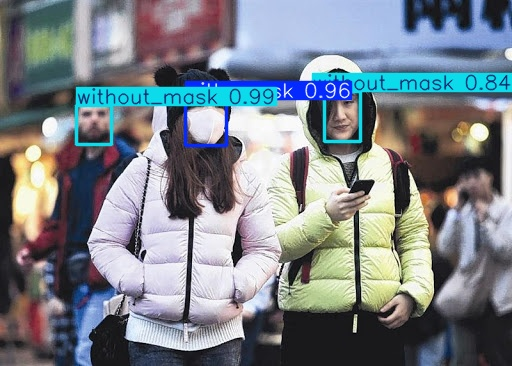
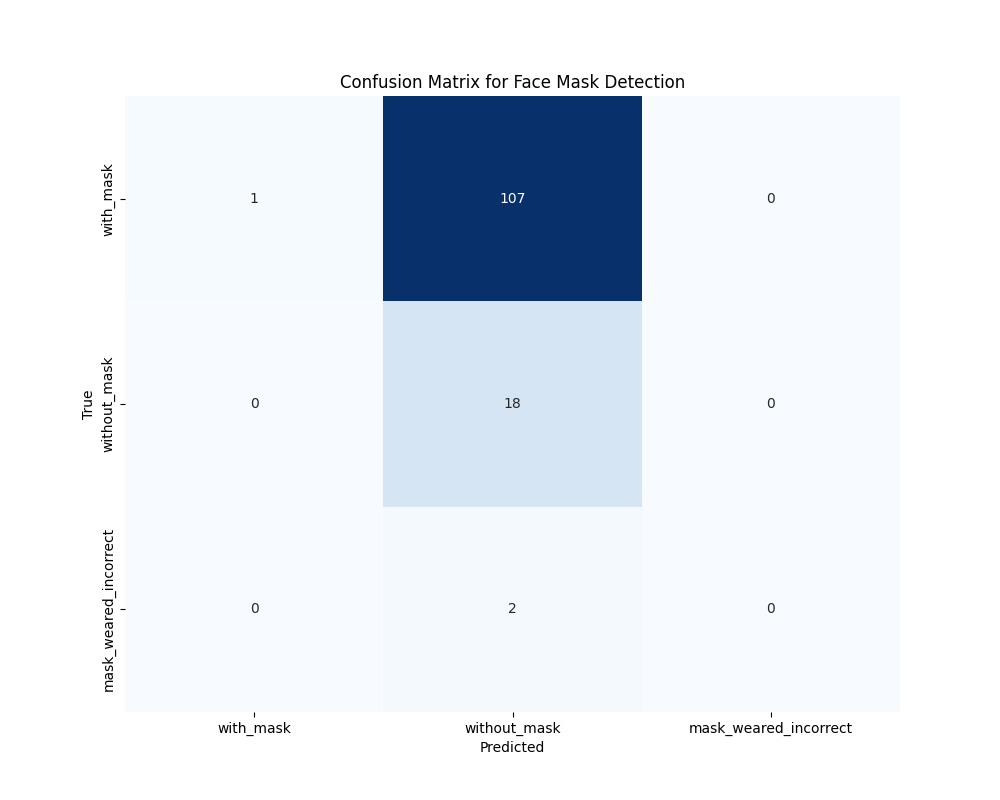

# Face Mask Detection

This repository contains the implementation of a Face Mask Detection system using YOLOv8, originally sourced from Kaggle. The project includes scripts for training, validation, and live predictions.

### Introduction
Face Mask Detection dataset is used as sample dataset to show the capability of Yolo architecture. With just traing 500+ images for 10 epochs is able to do prediction whether the  person is wearing a mask, not wearing a mask, or wearing a mask incorrectly. The accuracy can be further improved with further trainng.

- Training Script: Train the YOLOv8 model on a dataset of images for Face mask detection.
- Validation Script: Validate the model's performance on a test dataset.
- Live Prediction: Real-time face mask detection using a webcam.



### Installation
1. Clone the repository:
   ```bash
   git clone https://github.com/yourusername/face-mask-detection.git
   cd face-mask-detection
   ```

2. Install the required dependencies:
   ```bash
   pip install -r requirements.txt
   ```
3. Download the dataset from Kaggle, unzip the files and store tha images and annotations file in folder datasets.

### Training
To train the YOLOv8 model run the notebook face_mask_detection_training


### Validation
To validate the model, run the notebook face_mask_detection_validation and save the model as onnx format for deployment.


## Live Prediction
For live predictions using your webcam, execute:
```bash
python live_prediction.py 
```

## Results
The YOLOv8 model achieves decent accuracy in detecting face masks after training for 10 epochs. Below is a sample confusion matrix from the validation set:



## Contributing
Contributions are welcome! Please open an issue or submit a pull request for any improvements or bug fixes.

## License
This project is licensed under the MIT License. See the LICENSE file for details.
